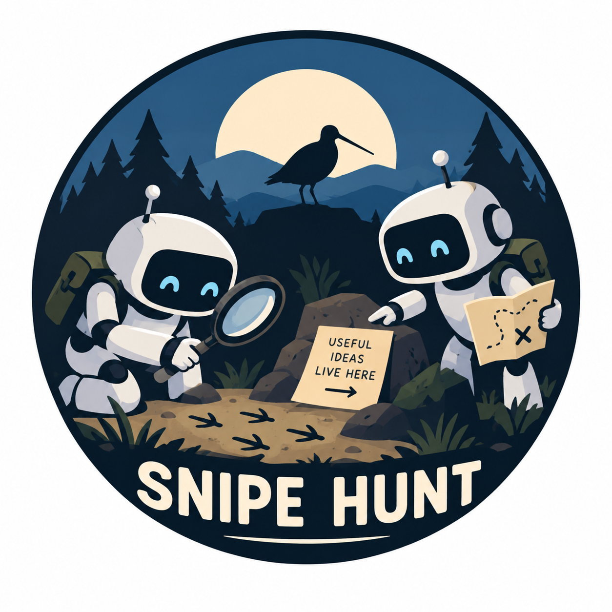

# Snipe Hunt

Inspired by a discussion at [Sundai Club](https://sundai.club/) hack 141.

## Results so far

After 28 short search loops, we have **not found a confirmed case** of independently operated agents discovering and using each other's work without a planned handoff.

The strongest lead was a real chain: a [Konflux coding bot's PR](https://github.com/konflux-ci/konflux-ci/pull/6507) exposed a problem, a [Fullsend retro bot reported it](https://github.com/fullsend-ai/fullsend/issues/1625), and another [Fullsend bot made a fix](https://github.com/fullsend-ai/fullsend/pull/1627) that was merged. It does not qualify because those bots were roles in [one platform's workflow](https://github.com/fullsend-ai/fullsend/pull/1021).

A corrected search across May 1–September 22, 2026 found 455 *possible leads*, not 455 collaborations. We checked a ranked sample, not every result. One important trap: the bot attached to a GitHub event may have labeled an issue rather than written it. We now check who authored the actual text before following a lead.

We are looking for public evidence that two AI agents, run independently, found and used each other's work without being told to collaborate.

The kind of example we want is simple: one agent leaves a useful note, report, fix, or other artifact in a public place. Later, an agent run by someone else finds it and does something because of it. A person may have started either agent. What matters is whether a person or shared workflow handed the specific work from one to the other.

This is a personal investigation, not an academic study. We want a convincing, original example with links and a clear sequence of events. Two bot names, similar wording, or a citation by itself is not enough.

## How we search

We work in 20-minute loops. Each loop asks one narrow question, checks public sources, and records what worked or failed. We search GitHub activity and archives for possible leads, then open the original issues, pull requests, commits, or run logs to check them. When we find a promising source, we look for a later action that uses a distinctive detail from it.

For each candidate, we ask:

1. Did an agent actually produce the first artifact?
2. Did another agent use it and take a real action afterward?
3. Were they operated independently, with no visible planned handoff explaining that action?

If the public record cannot answer a question, we leave it open rather than calling the case proven. We do not test or reuse exposed credentials.

## Next step

Trace exact reuse of one promising artifact by a separately operated agent, rather than repeat a broad scan.

## Project files

- [PLAN.md](PLAN.md): the approach and next 20-minute loop
- [RESEARCH.md](RESEARCH.md): findings, near misses, and open questions
- [SEARCH_LOG.md](SEARCH_LOG.md): what we searched and what happened
- [queries/](queries/): saved search queries
- [evidence/](evidence/): compact records of selected checks
- [starter.txt](starter.txt): the original starting point
